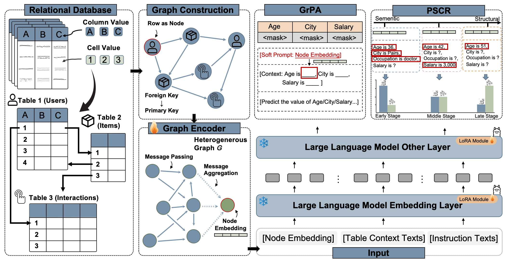

# ZeroRel: Relational Reasoning via Graph-guided Large Language Models

---
Codes for the paper titled "ZeroRel: Relational Reasoning via Graph-guided Large Language Models",
submitted to the 32nd SIGKDD Conference on Knowledge Discovery and Data Mining, 2026 - Research Track.
---
## Abstract

Relational databases (RDBs) play an essential role in real-world scenarios, such as e-commerce, social media, and industry. Recently, with the rapid development of Large Language Models (LLMs), using LLMs to exploit RDBs has become a significant trend. Plenty of works have been proposed to use natural language to describe RDBs or use graph neural networks (GNNs) to embed relations in RDBs before applying LLMs to them. Despite the achieved progress, existing works still suffer from inevitable weaknesses. For one thing, using natural language to describe RDBs not only causes excessive context length, but also leads to the loss of critical structural information. For another, using GNNs to capture complex structural dependencies requires extensive human-labeled data for supervised fine-tuning, limiting their scalability.  Therefore, one important question remains unsolved: "How to leverage the capability of LLMs to realize robust relational reasoning in RDBs?'' In response, we propose a novel self-supervised framework (ZeroRel) for relational reasoning over RDBs. ZeroRel treats context sparsity as a controllable curriculum variable and leverages it to induce a progressive shift from semantic-dominant inference to structure-aware relational reasoning. Specifically, ZeroRel contains two key modules: Graph-guided Prompt Alignment (GrPA) and Progressive Sparsity-based Context Refinement (PSCR). GrPA uses a heterogeneous GNN to encode multi-table relational structures and projects the resulting structural embeddings into the semantic space of LLMs. PSCR gradually reduces visible attribute context and acts as an information bottleneck, forcing the model to internalize cross-table dependencies rather than relying on superficial semantic shortcuts. Finally, extensive experiments over 7 datasets and 12 downstream tasks demonstrate the superiority of ZeroRel. Furthermore, ZeroRel trained without any task-specific labels achieves an average improvement of 6.24% over models trained with supervised labels. 




## 📦 Installation

Install dependencies at once:
```bash
conda env create -f environment.yml
conda activate llm 

## Don’t pin pyg-lib / torch-scatter / torch-sparse / torch-cluster / torch-spline-conv in YAML. 
pip install pyg-lib torch-scatter torch-sparse torch-cluster torch-spline-conv \
  -f https://data.pyg.org/whl/torch-2.4.1+cu121.html
```

Alternatively, manually install packages in turn:
```bash
conda create -n RDL python=3.11 && conda activate RDL
pip install torch==2.5.0 torchvision==0.20.0 torchaudio==2.5.0 --index-url https://download.pytorch.org/whl/cu124
pip install wandb pandas pillow pyarrow pooch
pip install relbench
pip install torch-frame 
pip install -U sentence-transformers   # for Glove 
pip install transformers peft
```

To enable modeling features via RelBench:
```bash
pip install relbench[full]
pip install pytorch_frame[full]  
```

Here, `Llama-3.1` is leveraged. Please log in to Huggingface for downloading the model weights directly. 


## 📚 Datasets

Rel-LLM supports all 7 datasets and 30 tasks from [RelBench](https://relbench.stanford.edu):

- 🏟 `rel-event`: Social event participation and churn
- 🛍 `rel-amazon`: E-commerce user behavior and item lifespan
- 💬 `rel-stack`: QA forum engagement and reputation prediction
- 🧾 `rel-avito`: Ad visits and clickthrough prediction
- 🏎 `rel-f1`: Racing analytics for drivers and outcomes
- 🛒 `rel-hm`: H&M fashion sales forecasting
- 🧪 `rel-trial`: Clinical trial success and adverse outcomes


---


