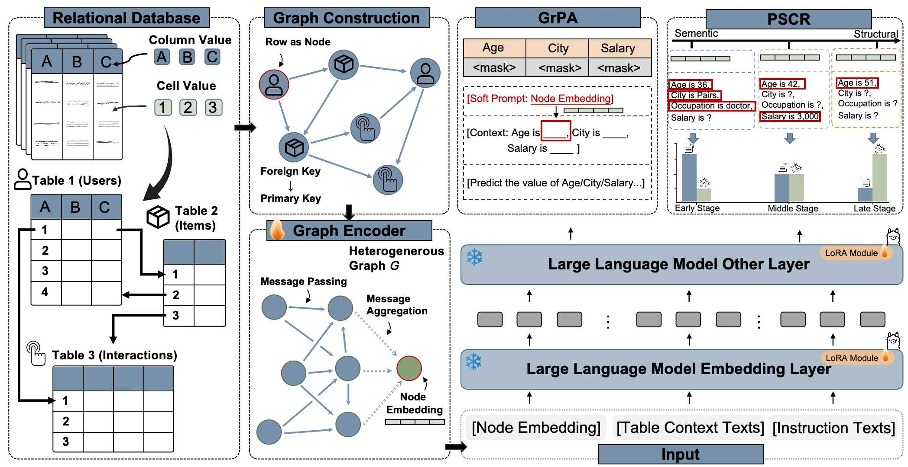

# ZeroRel: Relational Reasoning via Graph-guided Large Language Models

This repository contains the code for the paper **"ZeroRel: Relational Reasoning via Graph-guided Large Language Models"**, submitted to the **32nd SIGKDD Conference on Knowledge Discovery and Data Mining (KDD 2026), Research Track**.

<p align="center">
  
</p>

---

## Overview

Relational databases (RDBs) are essential in many real-world applications, including e-commerce, social media, healthcare, and industrial systems. With the rapid progress of large language models (LLMs), leveraging LLMs for reasoning over relational data has become an increasingly important research direction.

However, existing approaches still face two major limitations:

1. **Text-based serialization of RDBs** often leads to excessive context length and loss of structural information.
2. **Graph-based relational modeling** usually depends on supervised learning with large amounts of task-specific labels, which limits scalability.

To address these issues, we propose **RelZero**, a **self-supervised** framework for relational reasoning over RDBs. RelZero treats context sparsity as a controllable curriculum variable and uses it to drive a progressive transition from **semantic-dominant inference** to **structure-aware relational reasoning**.

Our framework consists of two key modules:

- **Graph-guided Prompt Alignment (GrPA)**: encodes multi-table relational structures with a heterogeneous GNN and projects the resulting structural representations into the semantic space of LLMs.
- **Progressive Sparsity-based Context Refinement (PSCR)**: gradually reduces visible attribute context and acts as an information bottleneck, encouraging the model to internalize cross-table dependencies instead of relying on superficial semantic shortcuts.

Extensive experiments on **7 datasets and 12 downstream tasks** demonstrate the effectiveness of RelZero. Notably, **RelZero trained without any task-specific labels achieves an average improvement of 6.24% over models trained with supervised labels**.

---

## Key Features

- **Label-free relational reasoning** through self-supervised learning
- **Graph-guided structural prompting** for multi-table databases
- **Progressive sparsity curriculum** to encourage robust relational inference
- **Compatible with RelBench** benchmarks for relational learning
- **LLM-based framework** that bridges structural modeling and semantic reasoning

---


## 📦 Installation

Install dependencies at once:
```bash
conda env create -f environment.yml
conda activate llm 

## Don’t pin pyg-lib / torch-scatter / torch-sparse / torch-cluster / torch-spline-conv in YAML. 
pip install pyg-lib torch-scatter torch-sparse torch-cluster torch-spline-conv \
  -f https://data.pyg.org/whl/torch-2.4.1+cu121.html
```

Alternatively, manually install packages in turn:
```bash
conda create -n RDL python=3.11 && conda activate RDL
pip install torch==2.5.0 torchvision==0.20.0 torchaudio==2.5.0 --index-url https://download.pytorch.org/whl/cu124
pip install wandb pandas pillow pyarrow pooch
pip install relbench
pip install torch-frame 
pip install -U sentence-transformers   # for Glove 
pip install transformers peft
```

To enable modeling features via RelBench:
```bash
pip install relbench[full]
pip install pytorch_frame[full]  
```

Here, `Llama-3.1` is leveraged. Please log in to Huggingface for downloading the model weights directly. 


## 📚 Datasets

Rel-LLM supports all 7 datasets and 30 tasks from [RelBench](https://relbench.stanford.edu):

- 🏟 `rel-event`: Social event participation and churn
- 🛍 `rel-amazon`: E-commerce user behavior and item lifespan
- 💬 `rel-stack`: QA forum engagement and reputation prediction
- 🧾 `rel-avito`: Ad visits and clickthrough prediction
- 🏎 `rel-f1`: Racing analytics for drivers and outcomes
- 🛒 `rel-hm`: H&M fashion sales forecasting
- 🧪 `rel-trial`: Clinical trial success and adverse outcomes


---


